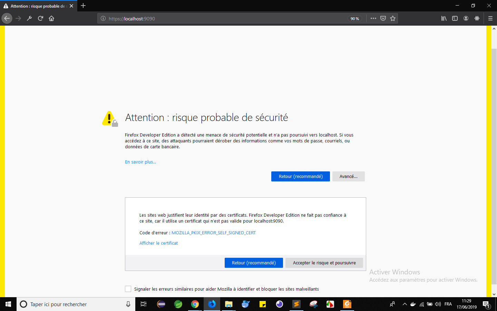
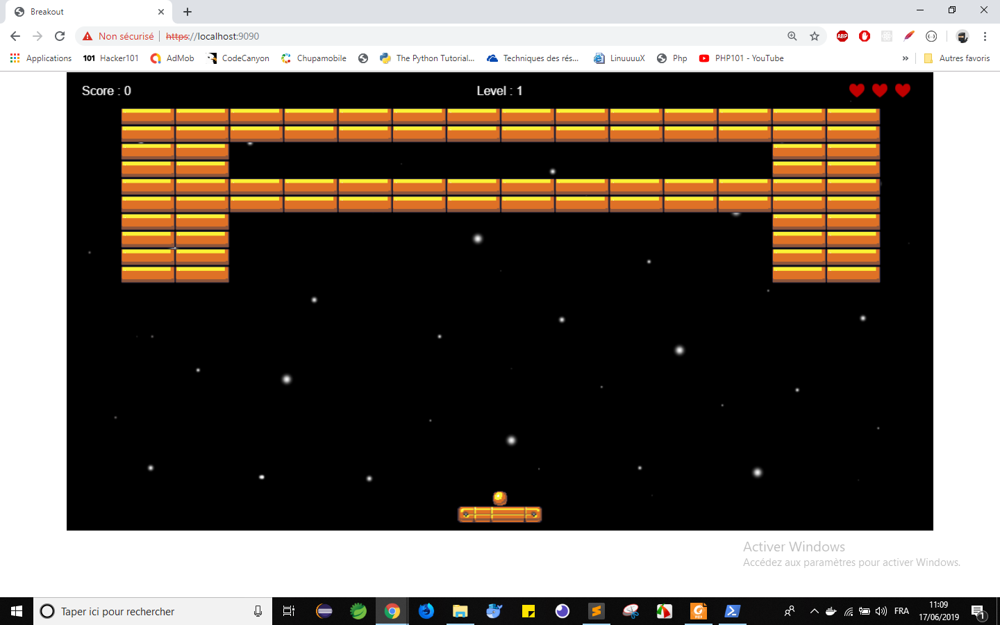

README

Hi this is Zakariaa SADEK , 

This is my source code for the Oracle Task

Fisrt of all clone the repository into your own laptop,

- Set up your Docker environment
- run : docker build -t test . 
- run : docker run -d -p 9090:443 test:latest 
- run : curl -k https://localhost:9090  

# nb : The -k flag is to turn off curl cert verification .

5- Enter to your browser and go to https://localhost:9090/ 

# nb: You will find a Certificate Error

6- Ignore it and you will get a web Page like 

7-  go to terminal and run the command as follow

abs -n 10000 -c 10 https://localhost:9090/ >> output.txt

8- See the output of the file in output.txt

------Weaknesses of my Dockerfile :

I think that my Dockerfile is not perfect yet , but i'm sure the the Self Signed certificates that i created is not suitable for production , so we need to purchase a certificate from a trusted Certificate Authority.
